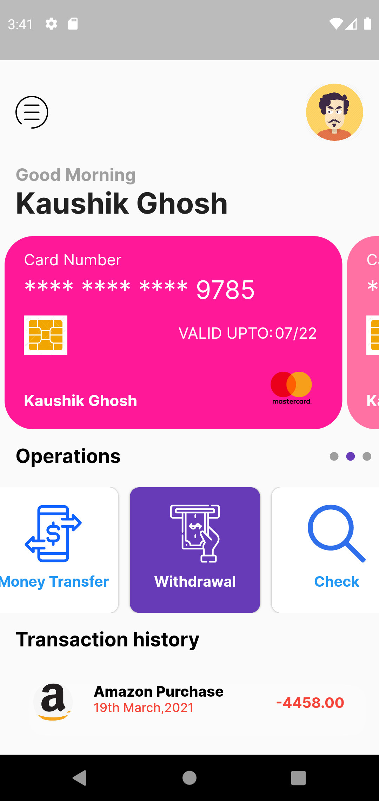
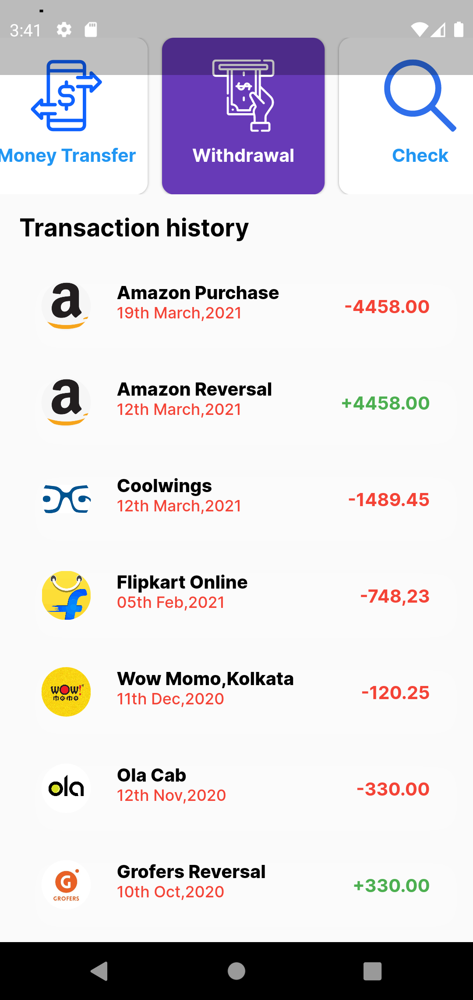

# money_management_ui

Money Management Frontend

## Getting Started

This project is a starting point for a Flutter application.

Page Design:

If the project after cloning not working and shows "Flutter : Target file “lib/main.dart” not found"
then goes to the terminal and execute the command

flutter run -t lib/main_dev.dart

